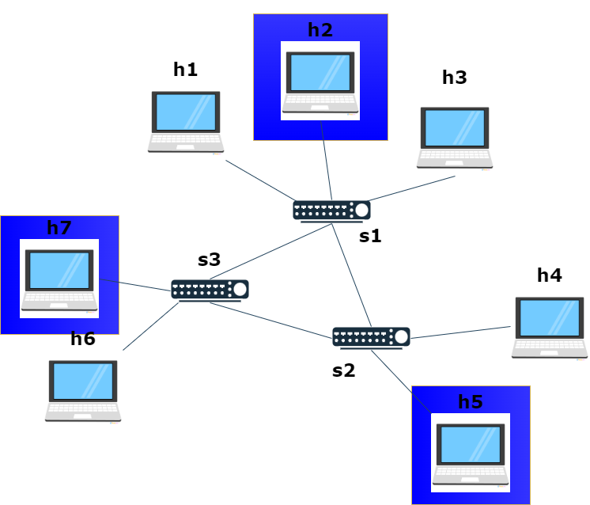

# Networking2-slicing-project

[presentation](https://www.canva.com/design/DAF6V0TGHew/y-J-cTY77p6Nq6W3_mctZA/edit?utm_content=DAF6V0TGHew&utm_campaign=designshare&utm_medium=link2&utm_source=sharebutton)

## Introduction ## 
The goal of this project is to implement a network slicing approach to enable dynamic activation/de-activation of network slices via GUI and CLI commands within Comnetsemu enviroment. The original Comnetsemu source code with all the detailed examples can be found here. 
 
A multi-hop technology is used for this emulation --> there are 7 hosts (h1,h2,h3,h4,h5,h6,h7) and 3 switches (s1,s2,s3) in the network: 
 
 
 
## Project Description ## 
Initially, all hosts can not communicate with each other and no slices are available. 
After that, you can decide to activate one, more or all slices by clicking the ON buttons or passing an ON command to the ryu controller, and you can deactivate them with OFF buttons or an OFF command (see the how to run section). 
 
The available slices are: 
 
* ### Slice 1 ### 
 
* ### Slice 2 ### 
 
* ### Slice 3 ### 
 

 
This folder contains the following files: 
* topologia.py -> python script to build the network as shown in the previous image. 
* project.py -> python script that permits to activate/de-activate slices via CLI commands. 
* init_link.sh -> bash script that deny hosts to communicate with each other. 
* slice1.sh, slice2.sh, slice3.sh -> bash scripts that build virtual queues that are used for communication between hosts. 
* gui.py -> python script that loads the GUI and manages buttons. 
 
# GUI 
 
 
## How to run: ## 
1. Connect with a comnetsemu portale (recommended) or install all the functionalities in your system. 
2. Switch to branch 'main': 
bash 
$ git checkout main 
3. Run the controller (this will open the GUI): 
bash 
$ ryu-manager --ofp-tcp-listen-port 6633 project.py
4. Emulate the topology with mininet: 
bash 
$ sudo mn --custom topologia.py --topo mytopo 
5. Use the button in the graphic interface to activate or de-activate slices.  
 
*Note 1:* Please stop the running Ryu controller before starting a new Ryu controller. 
 
*Note 2:* When you want to stop the mininet, please delete the topology as follows: 
bash 
mininet> exit 
$ sudo mn -c 
 
 
# CLI 
 
 
## How to run: ## 
1. Connect with a comnetsemu portale (recommended) or install all the functionalities in your system. 
2. Switch to branch 'dev': 
bash 
$ git checkout dev 
3. Run the controller: 
bash 
$ ryu-manager --ofp-tcp-listen-port 6633 project.py
4. Emulate the topology with mininet: 
bash  s
udo mn --custom topologia.py --topo mytopo
6. Insert ON and OFF command in the ryu controller tab 
 * write ON to activate all slices 
 * write ON N to activate only slice n (with N between 1 and 4) 
 * write OFF to de-activate all slices 
 * write OFF N to de-activate only slice n (with N between 1 and 4) 
 
*Note 1:* Please stop the running Ryu controller before starting a new Ryu controller. 
 
*Note 2:* When you want to stop the mininet, please delete the topology as follows: 
bash 
mininet> exit 
$ sudo mn -c 
## How to verify: 
In order to verify the connectivity between hosts and the right functioning of the slices, chose one of these methods: 
1. ping all hosts 
 bash 
 mininet> pingall 
  or ping 2 hosts directly: 
 bash 
 mininet> h1 ping -c3 h7 
   
2. verifying flows in each switch and check the virtual queues/slices, e.g. 
 bash 
 mininet> sh ovs-ofctl dump-flows s1
